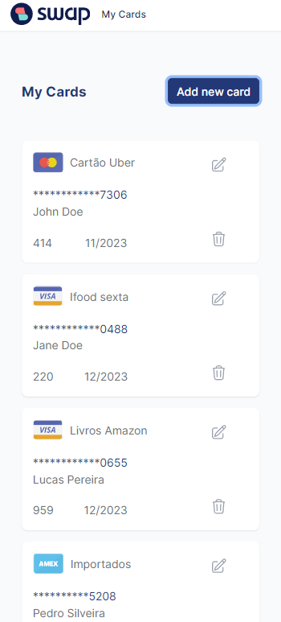
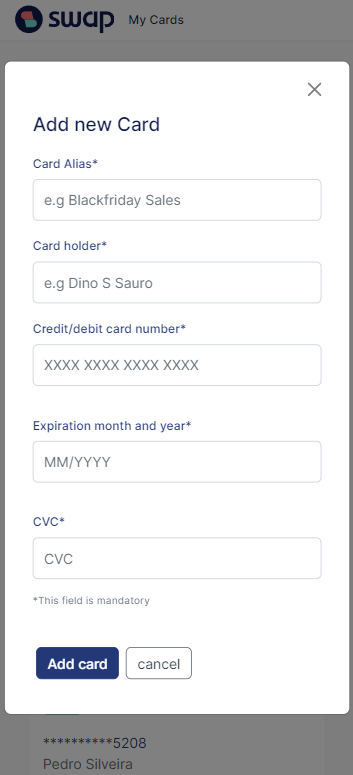
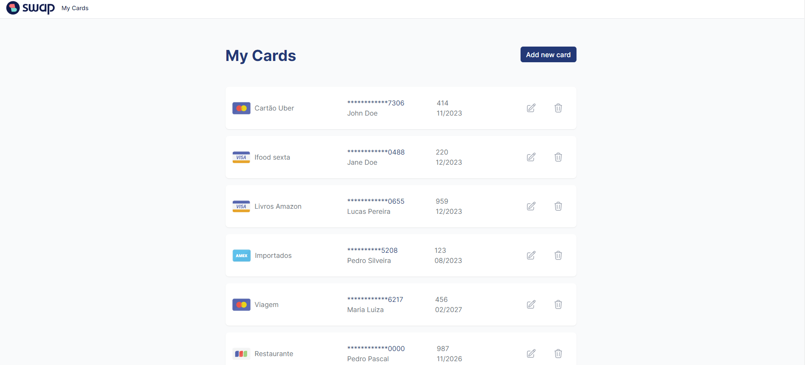
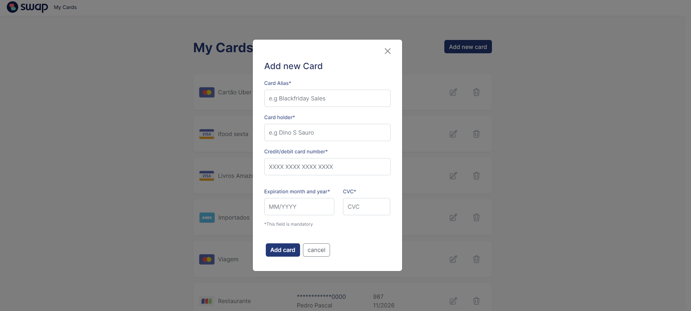

<p align="left">

  

  <a href="https://github.com/tgmarinho/README-ecoleta/commits/master">
    
  </a>
    
   

</p>
<h1 align="center">
  Desafio Front-End Swap
</h1>

<p align="center">
 <a href="#-sobre-o-projeto">Sobre</a> •
 <a href="#%EF%B8%8F-funcionalidades">Funcionalidades</a> •
 <a href="#-layout">Layout</a> • 
 <a href="#-instalação-e-execução">Instalação</a> • 
 <a href="#-bibliotecas">Bibliotecas</a> • 
 <a href="#-deploy">Deploy</a> • 
 <a href="#-scripts">Scripts</a> 
</p>

## 💻 Sobre o projeto

Desafio front-end da [Swap](https://www.swap.financial/) com o objetivo de implementar um código limpo, conciso de facil manutenção e seguindo todas as espeficicações funcionais e de estilo propostas. O objetivo do desafio foi desenvolver um simples CRUD para gerenciamento de cartões de crédito, armazendando todas as informações salvas no localstorage do navegador.

O desenvolvimento foi feito utilizando [React](https://pt-br.reactjs.org/) e [typescript](https://www.typescriptlang.org/) a partir do [Create React App](https://create-react-app.dev). O CRA foi escolhido por possuir uma boa configuração básica para a execução de testes e ter tudo o que é necessário para a proposta da aplicação. Typescript é utilizado para manter a qualidade e legibilidade do código.

Foram configuradas ainda tecnologias de qualidade de código com [eslint](https://eslint.org/) e [prettier](https://prettier.io/), além de usar [husky](https://typicode.github.io/husky/#/) para hooks de pre-commit e pre-push.

O projeto também possuí o [storybook](https://storybook.js.org/) configurado, possbilitando a inspeção de cada componente presente na aplicação, tal como seu funcionamento.

A página funcional pode ser acessada em https://felahgs.github.io/cartoes-swap/

---

## ⚙️ Funcionalidades

- Gerenciamento de cartões por meio de local storage
  - Listar cartões cadastrados
  - Adicionar um novo cartão
    - utilizando uma [api](https://lookup.binlist.net) para verificação da bandeira
  - Editar cartões existentes
  - Excluir cartões

---

## 🎨 Layout

### Mobile

<p align="center">
  
  

</p>

### Web

<p align="center" style="display: flex; align-items: flex-start; justify-content: center;">
  
  

---

## 🚗 Instalação e Execução

### Pré-requisitos

Primeiro é necessário instalar as seguintes ferramentas:
[Git](https://git-scm.com), [Node.js](https://nodejs.org/en/), [yarn](https://classic.yarnpkg.com/lang/en/docs/install/#debian-stable).

#### ▶️ Rodando a aplicação (servidor)

```bash

# Clone este repositório
$ git clone git@github.com:felahgs/cartoes-swap.git

# Acesse a pasta do projeto no terminal/cmd
$ cd cartoes-swap

# Instale as dependências
$ yarn install

# Execute a aplicação
$ yarn start

# A aplicação será aberta por padrão na porta:3000 - acesse http://localhost:3000
```

#### 🧭 Rodando o storybook

- Considerando que os dois primeiros passos da etapa anterior já foram realizados e já possuímos o repositório clonado e estamos no diretório do projeto.

```bash

# Clone este repositório (caso ainda não tenha feito para rodar a aplicação)
$ git clone git@github.com:felahgs/cartoes-swap.git

# Acesse a pasta do projeto no seu terminal/cmd (caso ainda não tenha feito para rodar a aplicação)
$ cd cartoes-swap

# Instale as dependências (caso ainda não tenha feito para rodar a aplicação)
$ yarn install

# Execute a aplicação em modo de desenvolvimento
$ yarn run storybook

# A aplicação será aberta por padrão na porta:6006 - acesse http://localhost:6006/

```

---

## 📚 Bibliotecas

As seguintes bibliotecas foram usadas na construção do projeto:

- [Jest](https://jestjs.io/pt-BR/) e [React Testing Library]() A ferramenta padrão de teste do CRA que possibilita a escrita de testes eficientes e com uma abstração próxima a da utilização do usuário
- [Mock Service Worker](https://mswjs.io/) O MSW é um Request handler que possibilita mockar chamadas com apis externas e foi utilizado para o teste da api dos cartões no projeto.
- [React Bootstrap](https://react-bootstrap.github.io/) Foi utilizada a biblioteca de componenentes para criação de alguns componentes como base. Apesar disso, a biblioteca a aplicada de forma que a customização dos componentes seja simples, além de utiliza estilos próprios, sem depender das classes do bootstrap.
- [Styled Components](https://styled-components.com/) Biblioteca de estilo utilizando css in js e possibilitando a criação de estilos isolados e bem customízaveis.
- [uuid](https://www.npmjs.com/package/uuid) Gerador de ids unicos usado na criação de cada cartão salvo no local storage.
- [React Use](https://www.npmjs.com/package/react-use) Uma biblioteca de hooks do react que facilitam a utilização de diversas funções, mantendo o código limpo e eficiente. Foram utilizadas as seguintes funções:

  - [useAsyncFn](https://github.com/streamich/react-use/blob/HEAD/docs/useAsyncFn.md) hook para lidar com chamadas assincronas que disponibiliza estados praticos de erro e loading
  - [usDebounce](https://github.com/streamich/react-use/blob/HEAD/docs/useDebounce.md) hook para aplicar debouncer em um evento. No projeto, foi muito util para chamar a api de verificação de cartão após o usuário terminar de digita-lo.
  - [useLocalStorage](https://github.com/streamich/react-use/blob/HEAD/docs/useLocalStorage.md) hook de acesso ao local storage que facilita o acesso e gravação no storage do browser, sem necessidade de aplicar conversão constante de string.

  ***

## 🚀 Deploy

O deploy da aplicação é feita de forma automatizada para https://felahgs.github.io/cartoes-swap por meio do [workflow](https://github.com/felahgs/cartoes-swap/blob/main/.github/workflows/build-deploy.yml) configurado no git hub actions.

Para cada push realizado na branch main sera executado um pipeline, verificando a versão de cada pacote por meio do **audit** e conferindo se a cobertura de testes do código atinge o valor minimo necessário de 90%.

## 📜 Scripts

Os scripts podem ser excutados por meio do comando `yarn [nome do script]`
Os seguintes scripts estão configurados no projeto:

- **start**: Inicia a aplicação no endereço "http://localhost:3000"
- **build**: Realiza o build do script para deploy
- **test**: inicia a interface de testes monitorando o código e executando qualquer teste que esteja relacionado com alguma alteração feita no código
- **test:all**: Realiza o comendo anterior mas realizando testes em toda a aplicação antes
- **test:cov**: Realiza o mesmo comando que o anterior mas imprimindo o relatório de teste coverage em tela
- **typecheck**: Verifica a tipagem de todo o código e imprime os arquivos que possuírem tipagem incorreta
- **lint**: Realiza o teste de lint no projeto imprimindo os arquivos que apresentarem erro de padrão de código
- **lint:fix**: corrige todos os erros possíveis de padrão de código,
- **prettier**: "Verifica o código em busca de erros de fromatação de código,
- **prettier:fix**: Corrige todos os erros de formatação de código,
- **format**: Executa list:fix e prettier:fix, corrigindo todos os erros possíveis de padrão e todos os erros de formatação de código
- **prepare**: Inicia configuração de pre-hooks do husky,
- **storybook**: inicia o storybook no endereço "http://localhost:6000",
- **build-storybook**: Realiza o build do storybook para deploy

---

## 🐹 Autor

<a href="https://https://github.com/felahgs">
 
 <br />
 <b>Felipe Souza</b></a>
 <br />

[](https://www.linkedin.com/in/felipe-garcia-de-souza-aa9aa773/)
[](mailto:fgsouza93@gmail.com)

---
